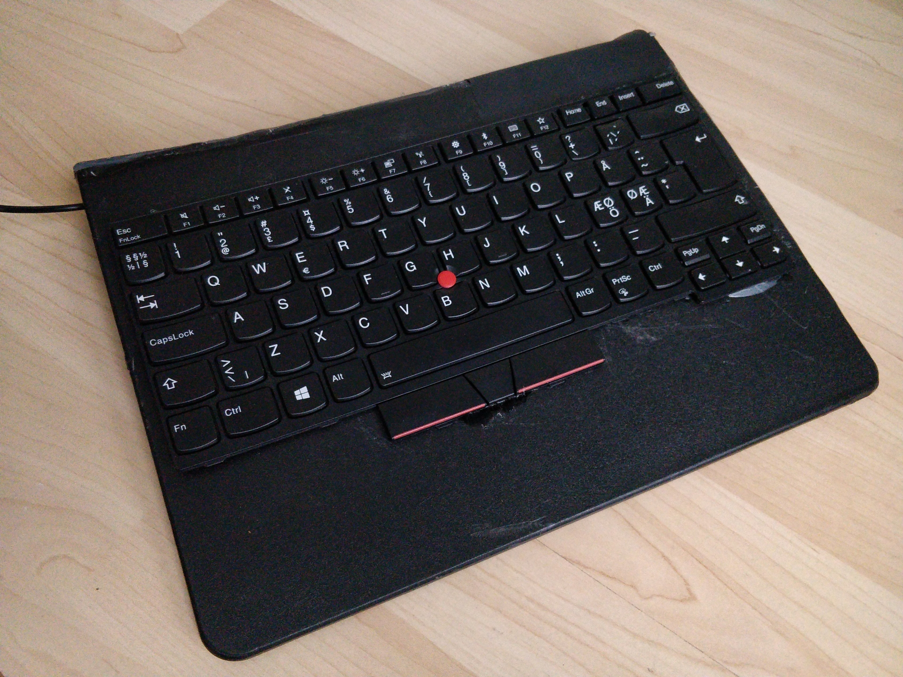
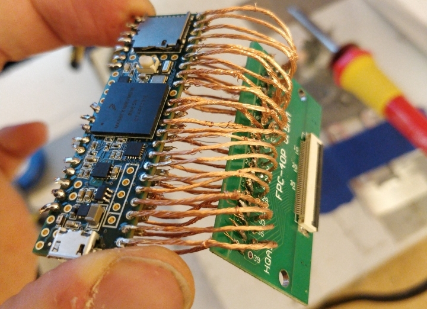
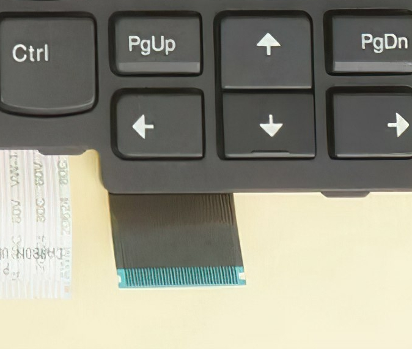

# Keyboard controller with Teensy 3 and Rust
DIY usb-keyboard from raw keyboard pad of laptop

## Introduction
### What?
This project implements a keyboard controller with Teensy 3 microcontroller. More precisely, this project turns raw keyboard pad into typical USB-keyboard. This keyboard pad may be obtained, for example, by extracting it from an old laptop, or buying it as a spare part. 

This repository contains code for keyboard controller. This _readme_ demonstrates also example of hardware implementation.

### Why?
My laptop's keyboard so good that I want to also use it on my desktop PC. With this project, I can have external USB keyboard that has the exact same layout as my laptop has. It's a pleasure to have unified _typing feel_.

### How?
**Hardware required:**
* Teensy 3 microcontroller
    * Had Teensy 3.6.
* Raw keyboard pad 
    * Had spare part for Lenovo Thinkpad T480.
* Way to connect the keyboard into microcontroller's pins.
    * Had a flat cable connector PCB. It can be found from ebay.
 
**Software used:**
* Keyboard controller (the content of this repository). The keyboard controller measures pin connections, translates them into key presses, and sends them over USB. This project implements it all in Rust. 
* [Teensy C/C++ libraries](https://github.com/PaulStoffregen/cores). These libraries control pins of microcontroller. Also, these libraries tell host pc that this is a USB keyboard.
* Bindings between Rust code and C/C++ libraries. The library [teensy3-rs](https://github.com/tolvanea/teensy3-rs) was made on the way for this purpose.

## Hardware
Hardware aspects was not a main point of this project. Being a programmer, I only care that the software is pretty and the keyboard is functional. The physical appearance was not very high on objective list. Now that the hardware aesthetics are sorted out of the way, here's how it ended up looking:

It is build on top of plastic chopping board, which was previously used in kitchen. Underneath the board lies Teensy microcontroller. Here's an image how flat cable adapter was soldered to Teensy's pins:

Copper wire is uninsulated, because that was the only wire I had in my room at the moment. Keeping up with DIY-theme, the wire was extracted from old vacuum cleaner. I later submerged the whole thing in hot glue to prevent short circuits, which also made it more rigid and durable. The flat cable connector in the picture connects to a keyboard. Keyboard's flat cable looks something like this:

[Credits of image goes to ebay seller _20come12_.] 

The flat cable has about 30 lanes, which are directly connected to digital pins in microcontroller. When some key is pressed on a keyboard, then two of these lanes will be electrically connected. The microcontroller scans these lanes 100 times in a second, finds out what lanes are connected, and translates them into corresponding key presses.

## Software
There are many small things to consider when translating pin connections into key presses. A naive key detection would be quite straight forward to implement, but this keyboard controller goes further, and does a complete implementation. Numerous fine details are sorted out correctly, though most of them are so rare corner cases, that they will never appear in practice. For example, if three or more non-modifier keys are simultaneously pressed, then naive implementation could register also other false key presses. Anyways, this keyboard controller detects all the key presses it possibly can, and it never reports a false press. As far as I know, it could not handle the job better. (Though not considering here performance, memory, or potential bugs.)

Features of this project are compared to well known DIY keyboard [controller template](https://github.com/thedalles77/USB_Laptop_Keyboard_Controller). It is emphasized that apples and oranges are compared here: This project is considerably more complex than the template, and this also has three times more the code lines (~900 vs ~300). 

**Defining features of this project:**
* **Very easy key configuration:** By pressing each key once through, correct pin-to-key configuration is detected. This configuration, a.k.a. "key matrix", is printed out, and it can be directly copy-pasted to source code. This makes the controller generic for any keyboard. The only "hard coding" is to copy-paste automatically generated keyboard matrix. This can be compared to the [controller template](https://github.com/thedalles77/USB_Laptop_Keyboard_Controller), which does not have any key matrix generation feature, which is why each different keyboard model has its own custom source code fork. Figuring out keymatrix without any tooling is laborious and hard.
* **Quick responsiveness:** Keys are sent over usb only when they have changed a state. This greatly reduces lag by not flooding USB with unnecessary packets. This, again, is in contrast to the [controller template](https://github.com/thedalles77/USB_Laptop_Keyboard_Controller)
* **Detection of simultaneous key presses:** As mentioned previously, this controller goes in lengths to handle simultaneous key presses correctly. As comparison, the [controller template](https://github.com/thedalles77/USB_Laptop_Keyboard_Controller) may register false presses if multiple keys are presses simultaneously. Another comparison can be also made: **this keyboard controller is even slightly more capable than the original made by Lenovo itself**: For example, my laptop keyboard can not register key press _F_ + _5_ + _F9_, but this USB keyboard can. They both use the exact same physical keyboard. I guess that Lenovo probably uses same keyboard controller software for both keyboards with numpad and without. If there is no numpad, there is also less valid pin connections, which can make some ambiguous combinations uniquely defined. Though, no one would ever benefit from being able to use such key combination, but why leave capabilities on the table in first place?
* **Fn and media key support.** This feature is not very special, as media keys are supported also in the [controller template](https://github.com/thedalles77/USB_Laptop_Keyboard_Controller). This feature is mentioned because Fn key is not really a standard key, and it requires some extra configuration. (By the way, automatic key matrix generation does not cover media key combinations. It is needed to hard code, for example, that F2 key corresponds to a volume decrease.)

**Known downsides of this project**
* Detection of complex key combinations requires some processing power. 
    * Detection takes up to 100 microseconds on teensy 3.6, which is negligible within 10 millisecond refresh rate. However, if microcontroller would have less than 1/100th of the perfomance, then this may arise a problem. 
    * There is probably no way to reduce performance requirements without giving up in correctness. 
* No backlight.
    * Would be fairly easy to implement, but it is not (yet) point of interest.
* If this keyboard controller happens to crash, the Teensy does not restart itself. Replugging the USB is required.
    * Automatic restarting should be fairly doable. However, it becomes more important only after the controller manages to crash itself once.
* The Thinkpad keyboard has integrated mouse buttons and trackpoint, but they are not used.
    * Getting them to work would require another flat cable adapter and _a lot of_ coding. No support planned.

## External Links
This project would not been possible without the following useful information sources:
* https://www.instructables.com/How-to-Make-a-USB-Laptop-Keyboard-Controller/
* https://github.com/thedalles77/USB_Laptop_Keyboard_Controller  
* https://github.com/jamesmunns/teensy3-rs-demo
* https://branan.github.io/teensy/2017/01/12/bootup.html

## License
Rust contributions are licensed under the MIT License.

**Please Note:** ASM, C, C++, and Linker Components of the `teensy3-sys` crate (a dependency of the `teensy3` crate) contain components licensed under the MIT License, PJRC's modified MIT License, and the LGPL v2.1. Please refer to individual components for more details.
