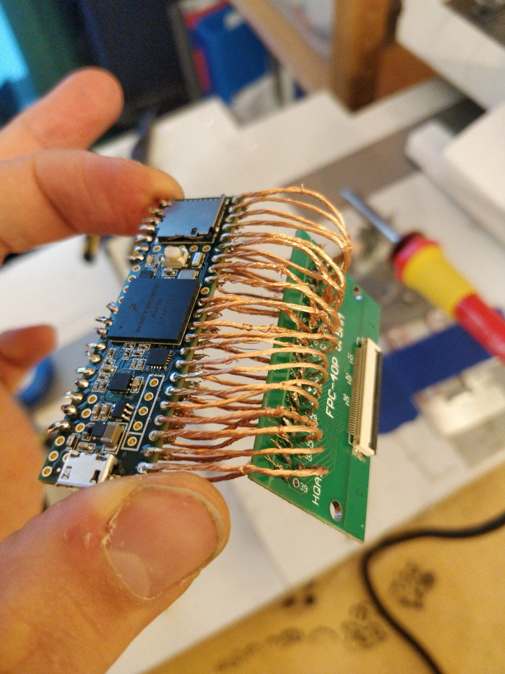

# Teensy3 keyboard controller with Rust

This project is based on template [teensy3-rs-demo](https://github.com/tolvanea/teensy3-rs-demo).

**TODO WRITE PROJECT PROPER DESCRIPTION**
* This implements the most optimal way to detect key presses. Everything that can be detected, is detected. This manages optimally those cases where pathologic situations where multiple keys are pressed at the same time. (In most cases this does not matter)
* This is slighlty better than original keyboard controller on by thinkpad! This is probably because Lenovo uses same controller firmware on both keyboards with and without numpad. Because I know I do not have numpad, I know some keys are impossible to press, which remove some conflictrs. For example, pressing 5 + F + F9 works on this project where it does not work on my thinkpad.
* Implements automatic configuration tool for figuring out key matrix. Just press through every key in keyboard, and let the program do the rest. (Overkill tool for others to use)
* Mediakeys are supported also
* Physical keyboard was never the object, but the software. 
* This code should work on any laptop keyboard. Libraries are build on top of teensy 3 however.
* Less lag! By sending only those keys that are needed 

  
  

The main aim here is to create usb keyboard by using teensy3 and laptop keyboard spare part. Teensy is model 3.6, and laptop keyboard is from Lenovo ThinkPad T480. Keyboard is connected to teensy with flat cable. When keys are pressed, they connect different lanes on flat cable, and teensy uses that information to send corresponding keys over USB port. 

This project would not been possible without following useful information sources:
* https://www.instructables.com/How-to-Make-a-USB-Laptop-Keyboard-Controller/
* https://github.com/thedalles77/USB_Laptop_Keyboard_Controller  
* https://github.com/jamesmunns/teensy3-rs-demo
* https://branan.github.io/teensy/2017/01/12/bootup.html

# License
Rust contributions are licensed under the MIT License.

**Please Note:** ASM, C, C++, and Linker Components of the `teensy3-sys` crate (a dependency of the `teensy3` crate) contain components licensed under the MIT License, PJRC's modified MIT License, and the LGPL v2.1. Please refer to individual components for more details.
